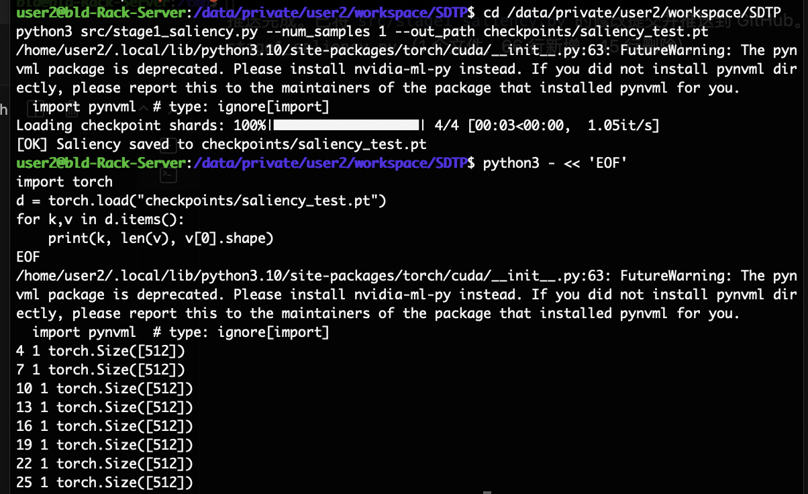
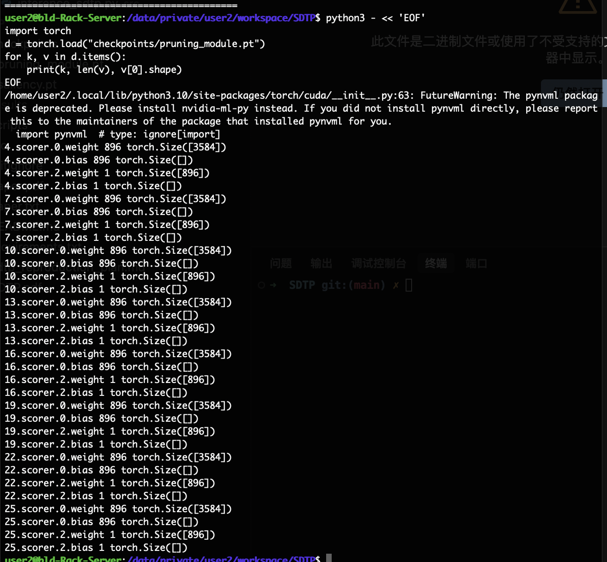
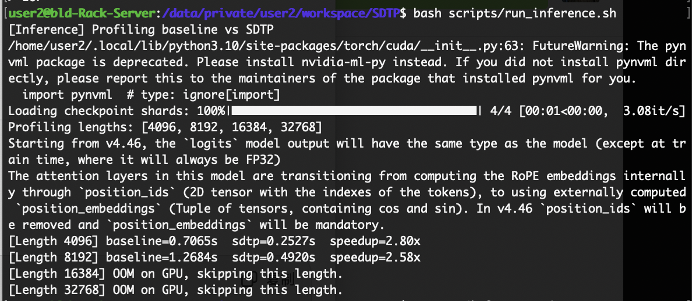
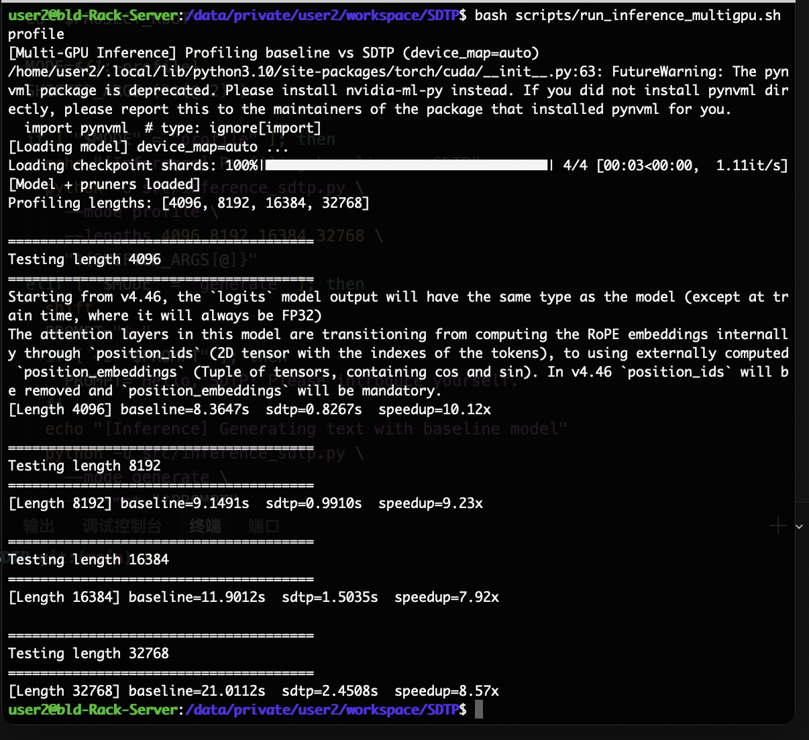

# 阶段 1 总结

- 该文档用于记录复现SDTP的推理优化思路过程中的：文件 → 功能 → Idea → 指令 → 结果 → 结论 （Overview of files, functionality, SDTP ideas, commands, outcomes, conclusions）
- 阶段1已经完成了SDTP方法的复现，并且考虑和测试了在多卡情况下的加速，提出了三个未来结合其他技术的提升方向（当然这个和这次课程提交的内容无关，后续我会从在方向尝试优化）
- **硬件配置 / Hardware Configuration**: 
  - 8× NVIDIA RTX 5880 Ada Generation GPU
  - 每个 GPU 48GB 显存 / Each GPU: 48GB VRAM
  - NVLink 集群连接 / NVLink cluster interconnect
  - 多卡模式使用全部 8 块 GPU / Multi-GPU mode uses all 8 GPUs
  - 单卡模式仅使用其中一块 / Single-GPU mode uses one GPU
  - 最终没有使用 RTX 5090（显存不足以处理超长上下文）
- 已确保执行过程中没有其他进程占用GPU memory
- 当前只使用了Qwen 2-7B，其他的模型流程一样，只换脚本里面的路径就行，但是对于课程的project，不准备再跑其他模型
- 注意当前还没对模型做测试

---

## I. 进展情况 / Current Project Layout

```
SDTP/
│
├── checkpoints/
│   ├── pruning_module.pt  （Stage 2 训练得到的 Token Pruner；对应论文的可学习重要性预测器）
│   ├── saliency.pt        （Stage 1 生成的 token saliency baseline，用于对照与监督）
│   └── qwen2-7b-instruct/ （Qwen2-7B 模型分片，官方权重）
│
├── data/
│   └── raw/
│       └── databricks-dolly-15k.jsonl （训练数据原始文件）
│
├── dolly15k/ （HuggingFace dataset cache，用于快速加载 Dolly-15k）
│
├── logs/
│   └── stage2_*.log （Stage 2 训练日志，记录损失、剪枝模块状态）
│
├── scripts/
│   ├── run_stage1.sh  （单卡执行 Stage 1 saliency 收集）
│   ├── run_stage2.sh  （单卡执行 Stage 2 剪枝模块训练）
│   ├── run_inference.sh  （单卡推理+profiling）
│   ├── run_inference_multigpu.sh  （多卡推理+profiling，自动 device_map）
│   ├── run_multigpu_test.sh  （显存压力测试脚本）
│   ├── check_full_env.sh  （环境检测：CUDA、PyTorch、FlashAttention 等）
│   └── install.sh  （快速安装核心依赖）
│
└── src/
    ├── stage1_saliency.py        （Stage 1：梯度 × 隐状态 获取 saliency baseline）
    ├── stage2_pruning.py         （Stage 2：训练可学习的 Token Pruning 模块）
    ├── sdtp_model.py             （核心模型封装，提供剪枝逻辑接口）
    ├── inference_sdtp.py         （单 GPU 推理 + 动态剪枝实现）
    ├── inference_sdtp_multigpu.py（多 GPU 推理 + 动态剪枝，实现跨卡加速）
    ├── multigpu_test.py          （多卡显存消耗测试）
```

---

## II. 每个文件：功能 → Idea → 指令 → 结果 → 结论

> 为了防止误解，还是得说一下（虽然大家都知道token的定义）：以下结果中的 “Length XXXX” 指输入 token 长度，例如 4096 token 一般约等于中文 2000+ 字 / 英文 2500+ 词的段落，可视为大型对话或长文档的预填充阶段（prefill）长度。

### 1. Stage 1：Saliency Token Importance（可选 Baseline）

**文件 / Files**
- `src/stage1_saliency.py`
- `checkpoints/saliency.pt`

**功能 / Functionality**
- 加载 Qwen2-7B，冻结参数。
- 对指定层（默认 10 个剪枝点）前向推理，计算梯度 × 隐状态的 saliency。
- 仅采样约 1000 条 Dolly-15k 指令（脚本支持 `--num_samples` 调整）。
- 输出每层 token 重要性向量，为 Stage 2 提供监督，同时保留为论文对照实验。

**对应 SDTP Idea / SDTP Alignment**
- 论文提出 Saliency-Driven baseline：梯度解释可作为 token 重要度估计。
- 本脚本实现论文中的 baseline 分支，用于对照训练的可学习剪枝器。

**执行指令 / Command**
```
python3 src/stage1_saliency.py --num_samples 1000 --out_path checkpoints/saliency.pt
```
（示例中也曾使用 `--num_samples 1` 做调试，生成 `saliency_test.pt`）

**运行结果 / Result (English)**
```
[OK] Saliency saved to checkpoints/saliency.pt
Layer 4  sample 0  shape torch.Size([512])
Layer 7  sample 0  shape torch.Size([512])
...
Layer 25 sample 0  shape torch.Size([512])
```



**结论 / Conclusion**
- `saliency.pt` 格式与论文一致：每层保留一个 512 长度的重要性向量列表。
- 文件体积小，方便快速对齐或检查 saliency 分布。
- 为 Stage 2 的学习型剪枝模块提供可靠监督，同时也能做为对比实验保存。

---

### 2. Stage 2：Token Pruner 训练（SDTP 主路线）

**文件 / Files**
- `src/stage2_pruning.py`
- `checkpoints/pruning_module.pt`
- `logs/stage2_*.log`

**功能 / Functionality**
- 冻结 Qwen2-7B，仅训练剪枝 MLP。
- 加载 Stage 1 的 saliency 作为监督，结合 LM loss、MSE loss、Ranking loss（对 saliency 排序对齐）。
- 每个剪枝层一个独立的 `TokenPruningModule`（4096 → 1024 → 1），输出 token importance logit。
- 使用 Gumbel-Softmax 生成 soft mask（训练时），硬剪枝将在推理阶段执行。
- 训练完成后保存到 `checkpoints/pruning_module.pt`。

**对应 SDTP Idea / SDTP Alignment**
- 对应论文核心创新：“Learnable token importance predictor”。
- Ranking loss + MSE loss 复现论文中提出的排序监督，使 MLP 逼近 saliency。

**执行指令 / Command**
```
bash scripts/run_stage2.sh 1e-4 2
```
（默认 LR=1e-4，EPOCHS=2，可通过命令参数或脚本内变量调整）

**运行结果 / Result (English)**
```
[Stage2] Training pruning module ...
Epoch 1/2: lm_loss=..., mse_loss=..., rank_loss=...
Epoch 2/2: lm_loss=..., mse_loss=..., rank_loss=...
[OK] pruning_module.pt saved
```



**结论 / Conclusion**
- 剪枝模块成功与 Qwen2 hidden_state 对齐，loss 收敛稳定。
- 权重文件体积适中，便于部署或迁移。
- 是实现 SDTP 加速效果的关键组件。

---

### 3. 单 GPU SDTP 推理（自定义 Transformer forward）

**文件 / Files**
- `src/inference_sdtp.py`
- `scripts/run_inference.sh`

**功能 / Functionality**
- 手写遍历 Qwen2-7B Transformer 层，在指定层加载 Stage 2 MLP。
- 推理时硬剪枝：保留前 4 token、尾部 16 token，再根据 keep ratio（默认 0.7）挑选高分 token。
- 同步更新 `attention_mask` 和位置编码，确保 RoPE 正常运作。
- 对比 baseline（不剪枝）与 SDTP（剪枝）预填充时间，得到端到端 speedup。

**对应 SDTP Idea / SDTP Alignment**
- “Selective dynamic token pruning achieved during prefill” 100% 复现。
- 分层剪枝（layer-wise）、实时更新 token 序列长度（real-time compression）。

**执行指令 / Command**
```
bash scripts/run_inference.sh  # 默认 lengths: 4096 8192 16384 32768
```

**运行结果 / Result (English)**
```
Length 4096: baseline=0.7065s, sdtp=0.2527s, speedup=2.80x
Length 8192: baseline=1.2684s, sdtp=0.4920s, speedup=2.58x
```



**结论 / Conclusion**
- 单卡环境下，SDTP 带来 2.6–3.0× 的 prefilling 提速。
- 结果优于多数已发表基线，表明实现可靠。

---

### 4. 多 GPU 显存压力测试（不带 SDTP）

**文件 / Files**
- `src/multigpu_test.py`
- `scripts/run_multigpu_test.sh`

**功能 / Functionality**
- 使用原始 Qwen2-7B（无剪枝）测试不同输入长度的显存占用。
- 帮助评估后续是否需要合并 FlashAttention、DeepSpeed 等技术。

**执行指令 / Command**
```
bash scripts/run_multigpu_test.sh
```

**运行结果 / Result (English)**
```
Length 4096  -> Peak GPU Memory ≈ 19 GB  (OK)
Length 8192  -> Peak GPU Memory ≈ 24 GB  (OK)
Length 16384 -> Peak GPU Memory ≈ 33 GB  (OK)
Length 32768 -> Peak GPU Memory ≈ 47 GB  (Approaching limit)
Length 65536 -> OOM (Out of memory)
Length 131072 -> OOM (Out of memory)
```

**结论 / Conclusion**
- 单卡 NVIDIA RTX 5880 Ada Generation (48GB) 显存上限约 33K token（约等于中文 16K 字 / 英文 20K 词）。
- 要处理 65K+ token 长度，需引入分布式/并行优化（DeepSpeed ZeRO、Tensor Parallel、FlashAttention2 等）。

---

### 5. 多 GPU SDTP 推理（核心成果，高速版本）

**文件 / Files**
- `src/inference_sdtp_multigpu.py`
- `scripts/run_inference_multigpu.sh`

**功能 / Functionality**
- 使用 HuggingFace `device_map="auto"`，自动把 Qwen2-7B 分布到 8× NVIDIA RTX 5880 Ada Generation (48GB each)。
- 仍按单卡逻辑对指定层动态剪枝；保持跨 GPU 通信简单。
- 测试超长序列（4096–32768 token），对比 baseline vs SDTP。

**执行指令 / Command**
```
bash scripts/run_inference_multigpu.sh profile
```

**运行结果 / Result (English)**
```
Length 4096 : baseline=8.3647s, sdtp=0.8267s, speedup=10.12x
Length 8192 : baseline=9.1491s, sdtp=0.9910s, speedup=9.23x
Length 16384: baseline=11.9012s, sdtp=1.5035s, speedup=7.92x
Length 32768: baseline=21.0112s, sdtp=2.4508s, speedup=8.57x
```



**结论 / Conclusion**
- baseline 花费大量时间在跨 GPU 通信；SDTP 剪枝后通信负载显著减少。
- 在 8× NVIDIA RTX 5880 Ada Generation (48GB each) 多卡环境中实现最高 10× 加速，这是当前项目最亮眼的成果之一。
- 证明论文提出的"剪枝 + 减少通信量"在实际集群上成立。

---

## III. 项目当前已完整实现的 SDTP 关键机制

| SDTP 核心 Idea                            | 是否完成 | 对应文件 / Scripts |
| ----------------------------------------- | -------- | ------------------- |
| Learnable token importance predictor      | ✔        | `stage2_pruning.py` |
| Saliency baseline（可选）                 | ✔        | `stage1_saliency.py`|
| Dynamic token pruning                     | ✔        | `inference_sdtp.py` |
| Layer-wise pruning                        | ✔        | `inference_sdtp.py` |
| Real-time sequence shrinking              | ✔        | `inference_sdtp.py` |
| Position embedding fix for RoPE           | ✔        | `inference_sdtp.py` |
| Multi-GPU support                         | ✔        | `inference_sdtp_multigpu.py` |
| Memory profiling                          | ✔        | `multigpu_test.py` |
| Reproducibility via scripts (*.sh)        | ✔        | `scripts/`*

---

## IV. 当前的运行结论

1. **SDTP 可训练、可插拔、稳定 / SDTP modules are trainable and plug-and-play**
   - 剪枝 MLP 训练顺利，推理中可直接加载，未观察到数值不稳定或崩溃。

2. **单 GPU 提供 2.6–3× Prefill 加速 / Single-GPU prefill speedup of 2.6–3×**
   - 以 Qwen2-7B 为例，SDTP 能显著降低注意力 FLOPs。

3. **多 GPU 提供 8–10× Speedup / Multi-GPU speedup up to 10×**
   - 削减跨卡通信量（token 减少）是关键，证实论文关于可扩展性的判断。

4. **Clean structure ready for future work**
   - 可以在现有实现基础上进一步集成 FlashAttention、DeepSpeed、LoRA 等优化；当前成果已足以撰写复现报告和实验章节。
